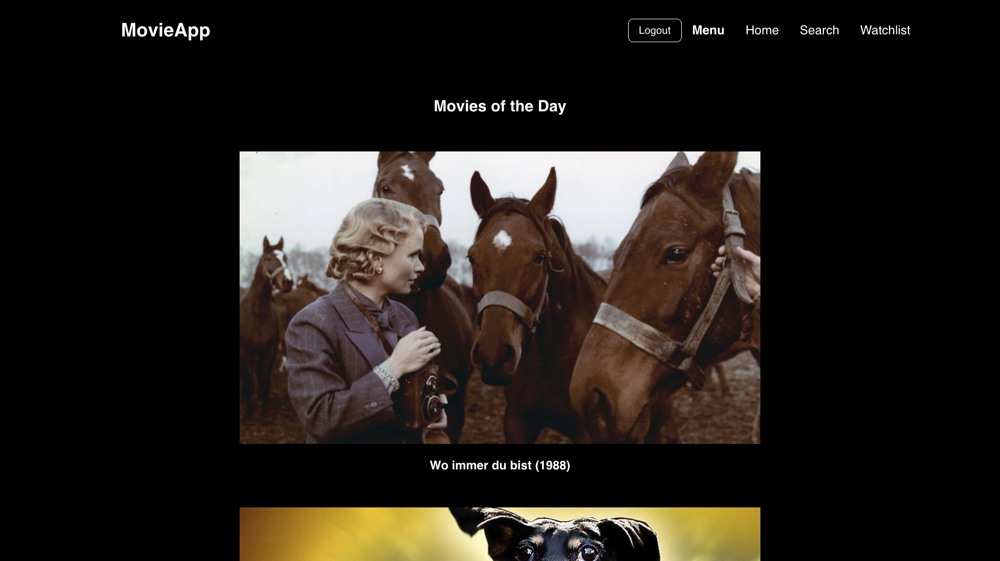
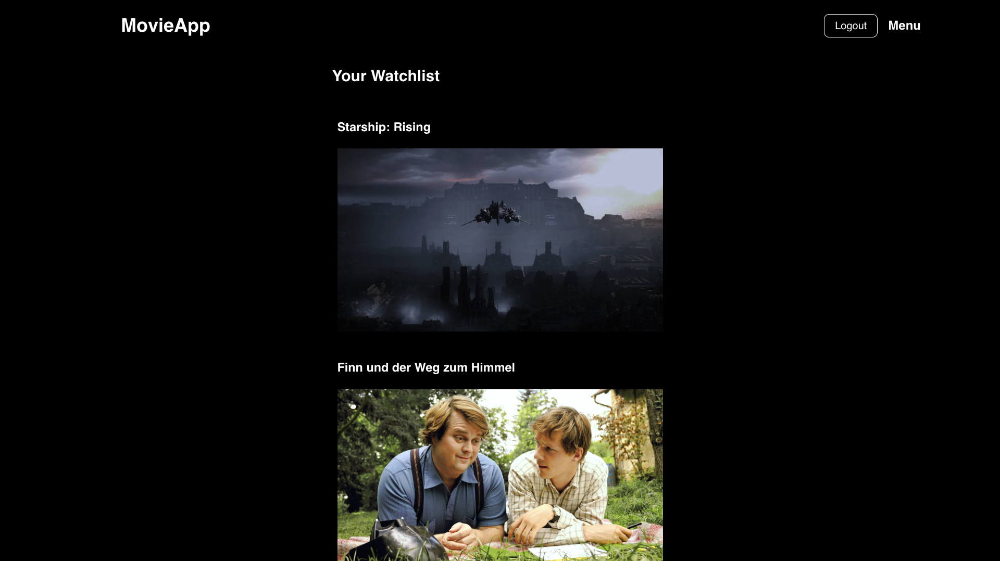
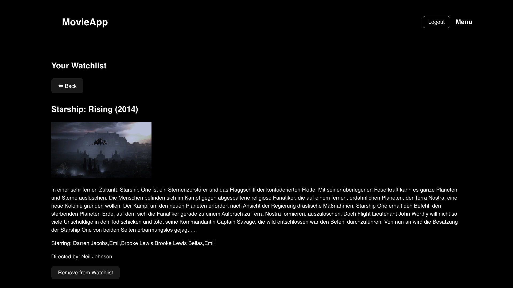

# Movie Search Application

- Integrated **movie search** powered by TMDB and Netzkino APIs, with in-memory caching to optimize external API calls
- **Daily Movie Picks** — rotating featured movies, cached by day to reduce overhead
- **Watchlist management** — users can add or remove movies to their personal collection
- Full CRUD support for Movies through RESTful APIs
- **Rate Limiting** on search endpoints (2 requests per 6 seconds) enforced via Bucket4j
- **Concurrent Caching** using ConcurrentHashMap for fast, thread-safe storage
- Global Exception Handling with custom responses and HTTP status codes (400, 404, 429, 500)
- Frontend built in React with styled components
- Frontend communication via Axios to backend APIs
- unit tests for core services and integration tests for REST endpoints

# Technologies

### Backend
[](https://skillicons.dev)

### Frontend
[](https://skillicons.dev)

# Preview

| Movies Of The Day | Search Movies | 
|:------:|:------:|
|  |  |
| Watchlist | Movie Details |
|  |  |

# Local development

### Backend
1. Clone the repository
2. Set environment variables
   ```
   export MONGODB_URI="mongodb+srv://<username>:<password>@your-cluster.mongodb.net/yourDb?retryWrites=true&w=majority"
   export NETZKINO_ENV="your-netzkino-api-key"
   export TMDB_API_KEY="your-tmdb-api-key"
   export OAUTH_GITHUB_ID="your-github-oauth-id"
   export OAUTH_GITHUB_SECRET="your-github-oauth-secret"
   ```
4. Run the application
   ```
   mvn spring-boot:run
   ```

### Frontend
1. Clone the repository
2. Install dependencies
   ```
   npm install
   ```
4. Run the development server
   ```
   npm run dev
   ```

# API Overview
### Movies
Get daily movies (cached per day)
```
GET /api/movies/daily
```
Search for movies (rate limited)
```
GET /api/movies/search?query={query}
```
Get all movies
```
GET /api/movies
```

Get movie by slug
```
GET /api/movies/{slug}
```

Create a new movie
```
POST /api/movies
Content-Type: application/json

Body:
{
  "id": "matrix",
  "tmdbId": 603,
  "slug": "matrix",
  "title": "The Matrix",
  "year": "1999",
  "description": "A mind-bending sci-fi classic.",
  "director": "Lana Wachowski, Lilly Wachowski",
  "stars": "Keanu Reeves, Laurence Fishburne",
  "img": "https://image.tmdb.org/t/p/original/matrix.jpg",
  "imgSmall": "https://image.tmdb.org/t/p/w500/matrix.jpg",
  "imgImdb": "https://m.media-amazon.com/images/I/matrix.jpg",
  "queries": ["sci-fi", "action", "classic"],
  "dates": ["2025-05-30", "2025-05-31"]
}
```

Update an existing movie
```
 PUT /api/movies/{slug}
Content-Type: application/json

Body (partial or full update):
{
  "description": "Updated description for The Matrix.",
  "stars": "Keanu Reeves, Carrie-Anne Moss",
  "year": "1999",
  "queries": ["sci-fi", "action", "updated classic"]
}
  ```
Delete a movie
```
DELETE /api/movies/{slug}
```

### Users
Get current user ID
```
GET /api/users/active
```
Save user info
```
POST /api/users/save/{userId}
```
Get user info by ID
```
GET /api/users/active/{userId}
```

### Watchlist
Add movie to watchlist
```
POST /api/users/watchlist/{githubId}/{movieSlug}
```
Remove movie from watchlist
```
DELETE /api/users/watchlist/{githubId}/{movieSlug}
```
